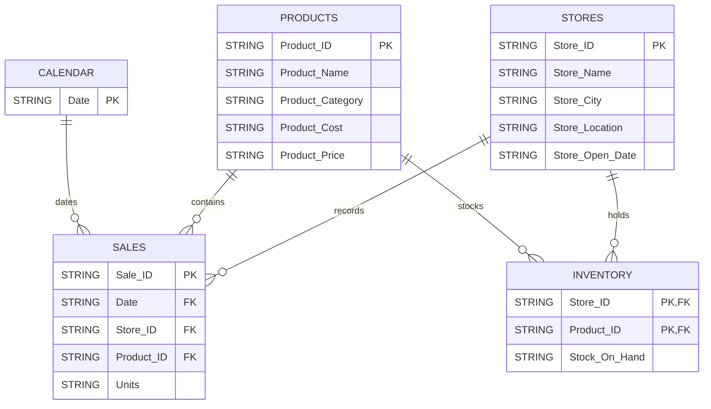

# Data Model

The Maven Toys source data follows a relational structure centered on sales, stores, products, inventory, and calendar dates.

## Relationship Summary

| From | To | Relationship |
|---|---|---|
| sales.Store_ID | stores.Store_ID | Many sales to one store |
| sales.Product_ID | products.Product_ID | Many sales to one product |
| sales.Date | calendar.Date | Many sales records to one date |
| inventory.Store_ID | stores.Store_ID | Many inventory records to one store |
| inventory.Product_ID | products.Product_ID | Many inventory records to one product |

## Grain

- stores: one row per store
- products: one row per product
- sales: one row per sales record
- inventory: one row per store-product combination
- calendar: one row per date

Key and relationship candidates were validated using SQL during the PREPARE stage. The raw BigQuery tables do not rely on enforced database constraints.
